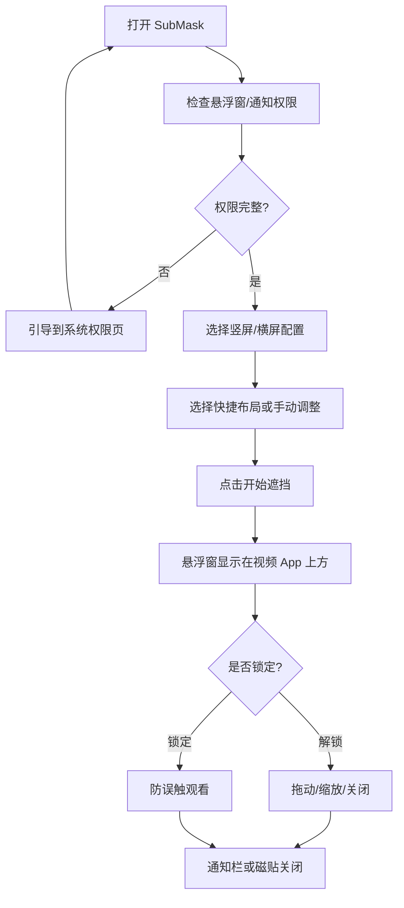
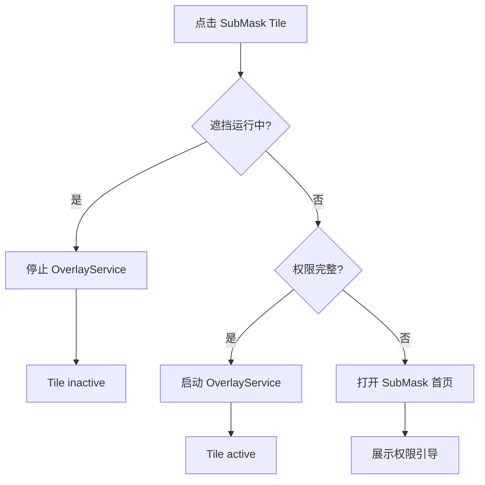

# SubMask 原型图

## 1. 首页结构

```text
┌────────────────────────────────┐
│ SubMask 字幕遮挡器        ⋮    │
├────────────────────────────────┤
│ 权限状态                       │
│ 悬浮窗  已授权/未授权           │
│ 通知    已授权/未授权           │
├────────────────────────────────┤
│ 竖屏 / 横屏                    │
├────────────────────────────────┤
│                                │
│        交互式遮挡预览           │
│     ┌────────────────────┐     │
│     │                    │     │
│     │     █████████      │     │
│     │                    │     │
│     └────────────────────┘     │
│                                │
├────────────────────────────────┤
│ 快捷布局                       │
│ [TikTok 全屏] [YouTube 半屏]   │
│ [横屏全屏]                     │
├────────────────────────────────┤
│ 遮挡透明度 72%                 │
│ ━━━━━━━━━●━━━━                 │
│ 宽度                           │
│ ━━━━━━━●━━━━━━                 │
│ 高度                           │
│ ━━━●━━━━━━━━━━                 │
│ 水平位置                       │
│ ━━━━━●━━━━━━━━                 │
│ 底部距离                       │
│ ━━━━━━━━●━━━━━                 │
├────────────────────────────────┤
│ [开始遮挡]                     │
└────────────────────────────────┘
```

右上三点菜单：

```text
⋮
├─ 使用帮助
└─ 关于
```

## 2. 快捷布局行为

- `TikTok 全屏`：切换到竖屏配置，遮挡区域位于竖屏短视频底部。
- `YouTube 半屏`：切换到竖屏配置，遮挡区域位于上半屏播放器字幕区。
- `横屏全屏`：切换到横屏配置，遮挡区域位于横屏底部。
- 点击快捷布局后，预览和所有滑块立即更新。
- 用户手动调整滑块后，配置视为自定义值。

## 3. 悬浮窗状态

解锁状态：

```text
┌──────────────────────────────┐
│ ×                         🔓 │
│                              │
│        半透明遮挡区域         │
│                              │
│                            ↘ │
└──────────────────────────────┘
```

- 可拖动。
- 可缩放。
- 可关闭。
- 可切换为锁定。

锁定状态：

```text
┌──────────────────────────────┐
│                           🔒 │
│                              │
│        半透明遮挡区域         │
│                              │
└──────────────────────────────┘
```

- 不可拖动。
- 不可缩放。
- 保留解锁入口。
- 避免看视频时误触。

## 4. 运行中透明度调节

```text
┌──────────────────────────────┐
│ SubMask 正在运行              │
│ 透明度 72%                    │
│ ━━━━━━━●━━━━━━                │
│ [关闭遮挡]                    │
└──────────────────────────────┘
```

- 运行中调节透明度应实时影响悬浮窗。
- 透明度为横竖屏共享设置。
- 调节结果应持久保存。

## 5. Quick Settings Tile

```text
系统快捷设置面板

┌──────────┐
│ SubMask  │ inactive：未运行
└──────────┘

点击后：
- 权限完整：启动遮挡，Tile 变 active。
- 权限缺失：收起面板并打开 App 权限引导。

┌──────────┐
│ SubMask  │ active：运行中
└──────────┘

再次点击：
- 停止遮挡，Tile 变 inactive。
```

## 6. 主流程



## 7. Quick Settings Tile 流程


