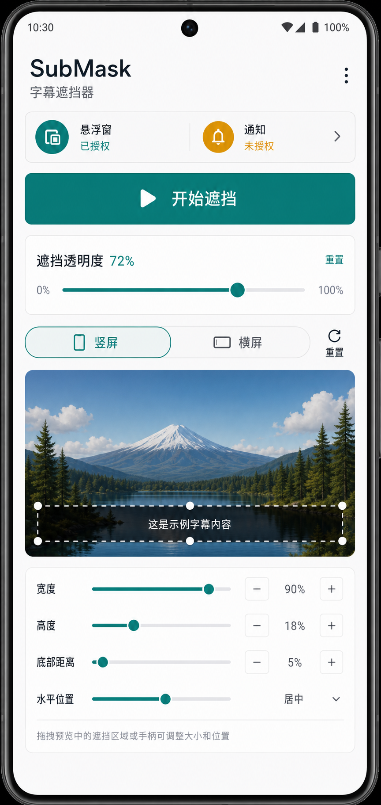

# SubMask Home UI Redesign Plan

## Summary

Replace the current simple white home screen with a lightweight control panel built with native Android Views. The home screen should focus on permission status, starting the overlay, opacity adjustment, and direct portrait/landscape mask size and position controls.

Reference concept:

## Key Changes

- Replace the plain title/button layout with a compact app bar: `SubMask`, `字幕遮挡器`, and a right-side overflow menu.
- Move `设置`, `使用帮助`, and `关于` into the overflow menu. In this first version, menu actions can show Toasts or simple placeholder dialogs.
- Add a permission status strip showing `悬浮窗` and `通知` independently, using a subtle warning color for missing permissions.
- Keep the primary action `开始遮挡`; permission handling continues to use the existing authorization flow.
- Keep shared opacity as a slider with a visible percentage label, for example `遮挡透明度 72%`.
- Add a `竖屏 / 横屏` segmented control. Each orientation reads and writes its own `OrientationConfig`.
- Add direct controls for the selected orientation:
  - `宽度`
  - `高度`
  - `水平位置`
  - `底部距离`
- Add a non-draggable preview panel that visualizes the selected orientation and current mask rectangle.
- Add a reset action that restores the selected orientation to its default mask rectangle.

## Implementation Notes

- Continue using native Android View code in `MainScreen`; do not introduce Compose.
- Reuse `OverlayConfigStore`, `MaskRect`, and `OrientationConfig` for persistence so `OverlayService` reads the same values after startup.
- Add a small pure Kotlin adjustment model if needed to map UI controls into a clamped `MaskRect`.
- Use simulated portrait and landscape bounds for the preview and controls; the preview does not need to start or inspect the overlay window.
- Save config changes immediately when sliders change so orientation settings survive app restarts.
- Do not change existing overlay drag, resize, lock, close, notification stop, or Quick Settings Tile behavior.

## Test Plan

- Run `.\gradlew.bat :app:testDebugUnitTest`.
- Run `.\gradlew.bat :app:assembleDebug`.
- Add or update unit tests for any pure Kotlin geometry/control mapping introduced for the new UI.
- Manually verify on device:
  - Missing overlay or notification permissions are shown separately.
  - Permission status refreshes after returning from system settings.
  - Opacity changes persist and affect the overlay after `开始遮挡`.
  - Portrait and landscape controls save independent rectangles.
  - Rotating the device uses the corresponding orientation rectangle.
  - Reset restores only the currently selected orientation.
  - Overflow menu opens and does not occupy permanent screen space.

## Assumptions

- Android 11+ remains the minimum supported version.
- The UI remains a utility control panel, not a marketing page.
- Main-screen adjustment uses sliders or stepper-style controls only; the preview is not draggable.
- The app keeps the current single-mask model and does not add subtitle detection, multiple masks, or per-app profiles.
